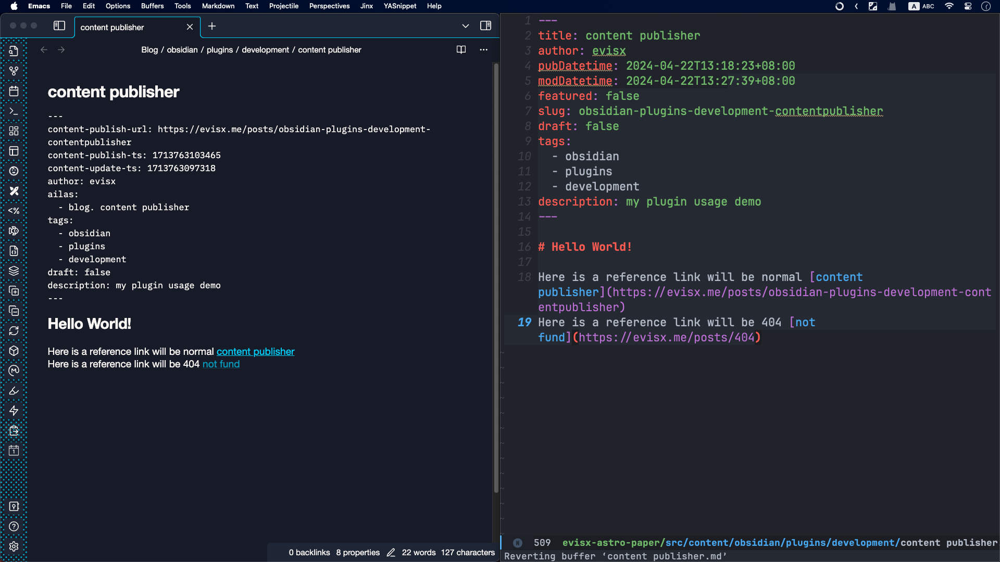
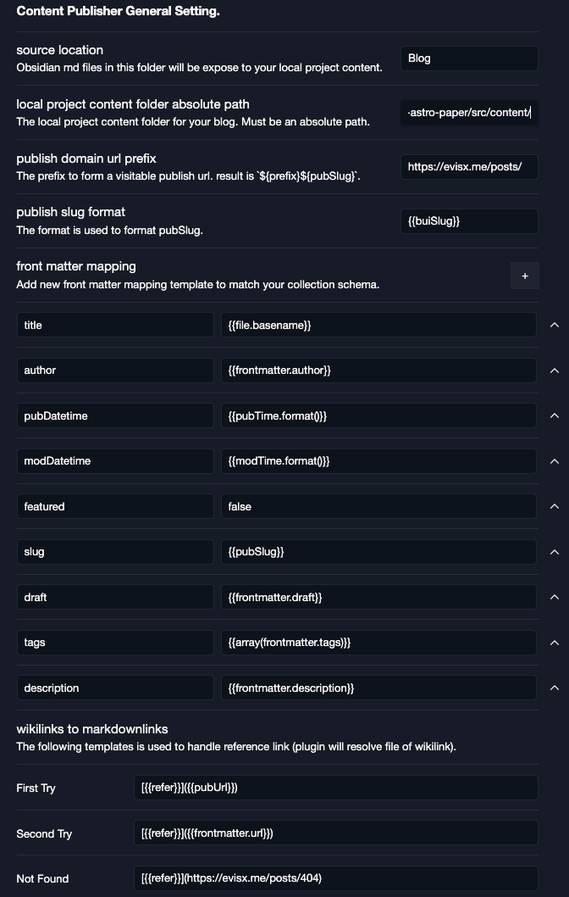

# Content Publisher

This is a obsidian plugin for export markdown to other markdown.

Currently can handle below during exporting.

1. YAML format which to form metadata.
2. Wikilinks handling, convert to other format base on setting. (mostly Markdonwlinks)

# Usage

Suppose that I have a blog base on [Astro](https://astro.build/), so I got local project like `/User/me/projects/astro-paper`. Markdown content in Obsidian has a little bit different in blog project. Therefore, I got this plugin to handle it, in order to keep my original notes in obsidian with obsidian way, and publish it to blog project with it's own way. (normally restrain by Markdown and project content schema)

# How to install

## For testers

You can install this plugin either manually or using the [BRAT](https://github.com/TfTHacker/obsidian42-brat) plugin.

### Installing using BRAT

BRAT is a beta-testing tool for plugins. It helps you install and update beta versions of plugins based on some additional metadata in this repo. If you’d like to install this plugin using BRAT:

1. [Install the BRAT plugin](obsidian://show-plugin?id=obsidian42-brat).
2. Run the `BRAT: Add a beta plugin for testing` command and paste in `https://github.com/evisx/obsidian-content-publisher`.
3. Click Add Plugin.
4. Navigate to Community Plugins in Obsidian settings, find Content Publisher, and enable it.

### Installing manually

To install manually, you'll need to:

1. Download the [latest release](https://github.com/evisx/obsidian-content-publisher/releases).
2. Find the folder named `.obsidian/plugins` in your vault and open it.
3. In that folder, create a new folder named `obsidian-content-publisher`.
4. Copy the files from the latest release and paste them into the folder you created.
5. Navigate to Community Plugins in Obsidian settings, find screen.garden, and enable it.

## Screenshot

### Demo

### Demo Setting

## How to use

After well setting.

1. In your source markdown file, call `Content Publisher: Publish current note` from obsidian command palette to publish content.

## Todos

-   [x] template script support (limit variables)
-   [x] handle metadata (YAML format, obsidian frontmatter)
-   [x] handle wikilinks
-   [ ] handle image
-   [x] publish single note
-   [ ] publish all notes

## How to develop

If you want to continue developing for this plugin, can follow:

-   Clone this repo.
-   Make sure your NodeJS is at least v16 (`node --version`).
-   `npm i` to install dependencies.
-   `npm run dev` to start compilation in watch mode.
-   Copy over `main.js`, `styles.css`, `manifest.json` to your test vault `TestVaultFolder/.obsidian/plugins/obsidian-content-publisher/`.

## API Documentation

See https://github.com/obsidianmd/obsidian-api
